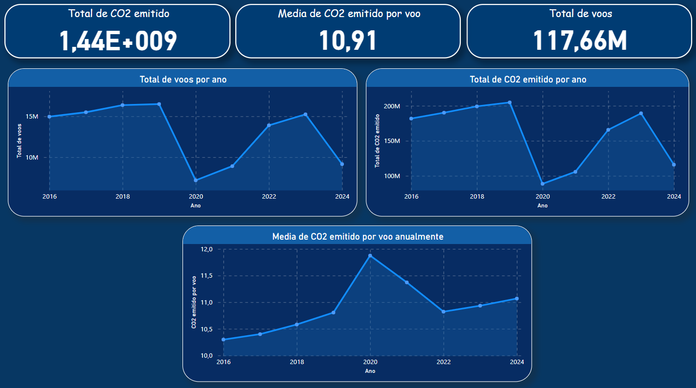

# Sobre o Projeto: Análise de Tráfego Aéreo e Emissões de CO2

Olá!

Este é o projeto de análise de dados de tráfego aéreo e emissões de CO2, desenvolvido utilizando Python, PostgreSQL, Power BI e ferramentas de visualização como Matplotlib e Seaborn. O objetivo do projeto é estudar a relação entre a quantidade de voos e as emissões de CO2 por diferentes países e períodos.

**Ferramentas Utilizadas**

  

# Descrição do Projeto

O projeto realiza a análise de dois conjuntos de dados: o tráfego aéreo e as emissões de CO2 de diferentes países, de 2016 a 2024. Os dados foram processados para limpeza e correção de inconsistências, e, em seguida, armazenados em um banco de dados PostgreSQL para consultas e análises posteriores.

# Funcionalidades

**Limpeza e Preparação dos Dados:**

Os dados de tráfego aéreo e emissões de CO2 foram carregados e limpos, com valores nulos preenchidos e normalização dos nomes de países.

**Análise Temporal:**

Análises anuais e mensais foram realizadas para ambos os conjuntos de dados, permitindo a visualização de tendências ao longo do tempo.

# Integração dos Dados

Foi realizado o merge entre os datasets de tráfego aéreo e emissões de CO2, corrigindo diferenças de nomenclatura entre países, como 'CZECHIA' e 'CZECH REPUBLIC'.

**Exportação para CSV:**

Após o tratamento e análise, os dados finais foram exportados para CSV para documentação e uso em relatórios futuros. 

**Banco de Dados:**

Utilizou-se o PostgreSQL para armazenamento dos dados, facilitando consultas e agregações complexas para relatórios.

**Visualização de Dados:**

Foram gerados gráficos para análise das emissões de CO2 e tráfego aéreo por ano e por mês, usando as bibliotecas Seaborn e Matplotlib. Além disso, foi utilizado Power BI para fazer dashboards interativos, proporcionando uma melhor compreensão e entendimento dos dados.

# Visões e Análises

**Gráficos Anuais:**

- Total de Voos por Ano: Gráfico de linhas mostrando a variação do número de voos ao longo dos anos.
- Emissões de CO2 por Ano: Gráfico de linhas mostrando as emissões de CO2 por ano.
- Eficiência de CO2 por Voo por Ano: Calculada a quantidade de CO2 emitida por voo para cada país e ano.

**Gráficos Mensais/por Território:**

- Total de Voos por Mês e por País: Análise mensal por país para entender os picos de tráfego aéreo ao longo do ano.
- Total de Emissões por Mês e por País: Análise mensal por país para entender os picos de emissão de CO2 ao longo do ano.
- Eficiência de CO2 por Mês e por País: Análise mensal por país para entender a eficiência de CO2 por voo ao longo do ano.

**Gráficos com Ranking dos países:**
- Ranking dos países que mais emitiram CO2: Análise total por país para conseguir observar quais países emitiram mais CO2.
- Ranking dos países que tiveram o maior trafego de voos: Análise total por país para conseguir observar quais países tiveram o maior trafego de aeronaves.
- Ranking dos países que tiveram a menor eficiência em emissão de CO2: Análise total por país para conseguir observar quais países tiveram a menor eficiência na emissão de CO2 por voo.

